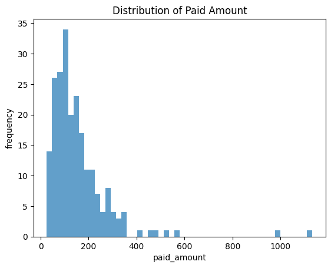
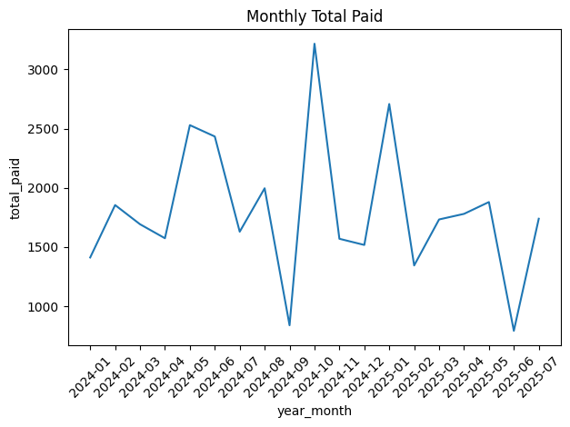
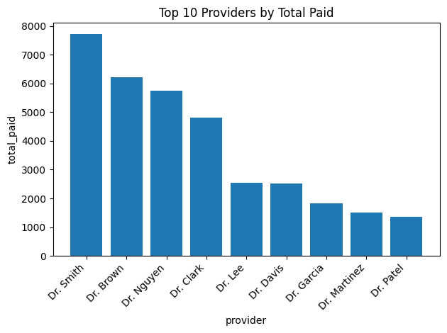
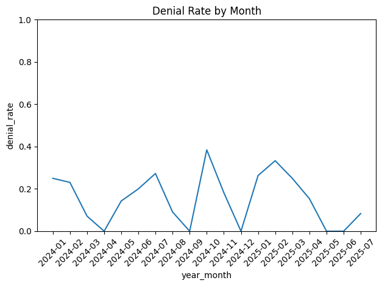

# HC01 — Healthcare Claims Exploratory Data Analysis (EDA)

## 📌 Project Overview
This project is part of **Phase 0** of my CUP Master Plan.  
The goal is to analyze healthcare claims data using **SQL + Python (pandas + matplotlib)** to extract meaningful insights, build reproducible workflows, and create recruiter-friendly deliverables.  
It also serves as the foundation for advanced analytics in healthcare and insurance.

---

## 📂 Project Structure
```
healthcare-claims-eda/
├── data/          # Input datasets (claims, members, providers)
├── sql/           # SQL queries (01_basics.sql, joins, cleaning scripts)
├── notebooks/     # Jupyter notebooks (EDA, visualizations)
├── docs/          # Data dictionary, screenshots, supporting docs
├── artifacts/     # Auto-generated summaries (e.g., eda_profile_summary.csv)
├── README.md      # Project overview
└── LICENSE        # MIT open-source license
```

---

## 📊 Dataset Overview
- **Claims:** 220 records, 18+ features (IDs, amounts, codes, plan details, flags).
- **Members:** 50 unique members with demographics and enrollment info.
- **Providers:** 20 unique providers with specialty and network info.

For detailed schema: [📘 Data Dictionary](docs/data_dictionary.md)

---

## 🔎 Key Insights (from EDA)
- **Total claims analyzed:** 220  
- **Total billed:** 64,295.80  
- **Total paid:** 34,240.77  
- **Average paid per claim:** 155.64  
- **Denial rate:** 16.4%  
- **Top providers:** Concentrated among 20 providers (see charts).  
- **Seasonality:** Paid amounts vary by month (monthly trend plotted).  

---

## 📈 Visuals

### Distribution of Paid Amount


### Monthly Total Paid


### Top 10 Providers by Total Paid


### Denial Rate by Month


---

## ⚙️ Technical Stack
- **Database**: SQLite (queries in `/sql`)  
- **EDA Tools**: Python (pandas, numpy, matplotlib)  
- **Version Control**: Git & GitHub  

Artifacts:
- Notebook: [`notebooks/01_eda.ipynb`](notebooks/01_eda.ipynb)  
- Profile summary: [`artifacts/eda_profile_summary.csv`](artifacts/eda_profile_summary.csv)  

---

## 🚀 How to Reproduce
1. Clone the repo:
   ```bash
   git clone https://github.com/bgarg85/healthcare-claims-eda.git
   cd healthcare-claims-eda
   ```
2. Load the SQL scripts in SQLite:
   ```sql
   .read sql/01_basics.sql
   ```
3. Run the EDA notebook:
   ```bash
   jupyter notebook notebooks/01_eda.ipynb
   ```

---

## 📖 Related Blogs
- [Why I’m Learning SQL + Python with Healthcare Data](https://www.linkedin.com/posts/bhanu-garg-25699614_healthcaredata-sql-python-activity-7366199184254836736-Qd5m?utm_source=share&utm_medium=member_desktop&rcm=ACoAAAL-LuIB6PLVnQ3cZdiy4U7LLEZrDb3CPV4)  
- [From CSV to Insight — My First Healthcare Claims EDA in Python](your-blog-link-2-coming-soon)  
- HC01 Showcase Blog: Exploratory Analysis of Healthcare Claims Data (coming soon)  

---

## 📜 License
This project is licensed under the [MIT License](LICENSE)
